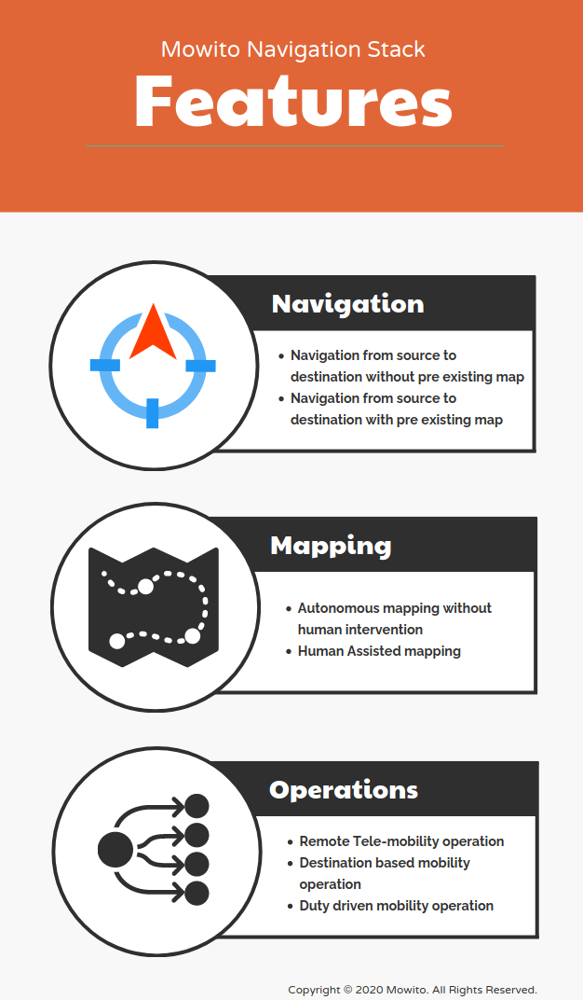

=============================
About Mowito Navigation Stack
=============================

--------
Overview
--------

Mowito’s Navigation Platform, is a software with a module dedicated for each specific task of navigation, such as planning, controlling, recovering etc. 

Each module can be configured, tested and even replaced by another custom module. All the platform needs are the details about the task or location of the goal,  and then based on the sensor inputs, it will drive the robot to perform the given task or reach the goal. 

The critical features of the platform are its  flexibility and the fast obstacle avoidance.
Our controllers are optimized to detect the obstacles and correct the path at a high frequency, without waiting for the obstacle to clear the path.

You can see our controller in action on our website mowito.in

--------------------------------
Features of the Navigation Stack
--------------------------------

