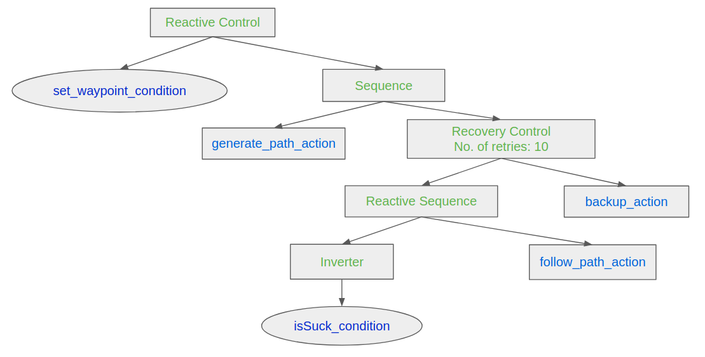
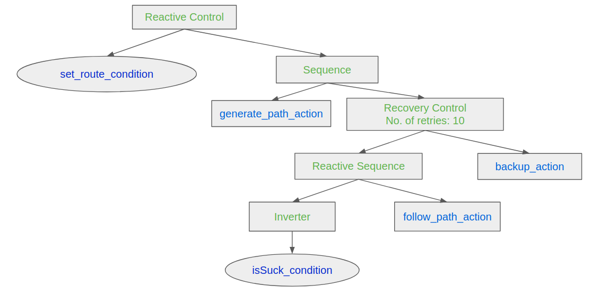
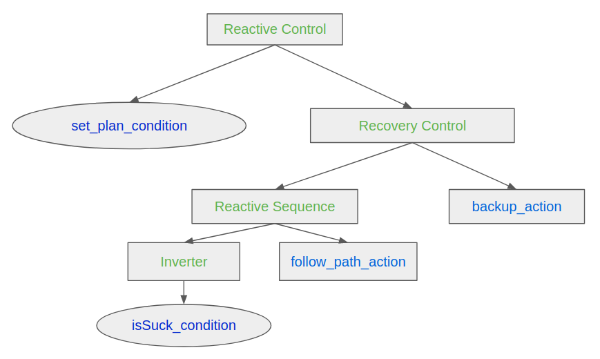
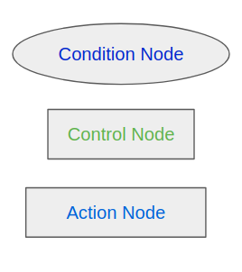

Behavior Tree for the Mowito Stack 
===========================================

Overview
-------------------------------------
The behavior tree package provides:

	- The ability to use mowito’s features in a modular fashion.
	- The ability to change the tree nodes dynamically without re-compiling the whole stack.
	- Easy-to-use XML templates over which the user can add their own features. 

Behavior Tree Node Description
----------------------------------------------------------------------------------

The behavior tree package for the Mowito Stack provides navigation-specific nodes which can be used directly in a Behavior Tree. 

+------------------+-----------+----------------------------------------------------------------------------------------------------------------------------------------------------------------+
| BT Node          | Type      | Description   																			|
+==================+===========+================================================================================================================================================================+
| folllow_path 	   | Action    | Invokes Mowito's controller action server and makes the robot follow a given path. The node returns SUCCESS if the controller action server succeeds otherwise | 
|		   |	       | returns RUNNING.						  										      		|	
+------------------+-----------+----------------------------------------------------------------------------------------------------------------------------------------------------------------+
| generate_path    | Action    | Invokes Mowito's planner action server and generates a path for a given goal. The node returns SUCCESS if the planner action server succeeds otherwise returns	| 
|		   |	       | RUNNING.						  										     		        |
+------------------+-----------+----------------------------------------------------------------------------------------------------------------------------------------------------------------+
| backup           | Action    | Invokes Mowito's recovery action server to make the robot move back to a specific pose. The node returns SUCCESS if the recovery action was successful 	|
|		   |           | otherwise returns RUNNING.																	|
+------------------+-----------+----------------------------------------------------------------------------------------------------------------------------------------------------------------+
| clear_costmap    | Action    | Invokes Mowito's recovery action server to delete the current global-costmap. The node returns SUCCESS if the recovery action was successful otherwise 	|
|		   |           | returns RUNNING.																		|
+------------------+-----------+----------------------------------------------------------------------------------------------------------------------------------------------------------------+
| isStuck          | Condition | Determines whether the robot is stuck or not using the robot's odometry. If the robot is not progressing, the condition will return SUCCESS, 			|
|                  |           | otherwise it will return FAILURE 																|
+------------------+-----------+----------------------------------------------------------------------------------------------------------------------------------------------------------------+
| set_waypoint     | Condition | This condition takes in the Rviz goals given by the user and checks if all the goals have been pursued. If the goals given by the user 			|
|                  |	       | are being pursued, the condition returns SUCCESS, otherwise it will return FAILURE.										|
+------------------+-----------+----------------------------------------------------------------------------------------------------------------------------------------------------------------+
| set_route        | Condition | This condition takes in the goals given by the user via a route.yaml (type) file and checks if all the goals have been pursued. 				|
|                  |           | If all the goals given by the user are being pursued, the condition returns SUCCESS, otherwise it will return FAILURE.						|
+------------------+-----------+----------------------------------------------------------------------------------------------------------------------------------------------------------------+
| set_plan         | Condition | This condition takes in a plan given by the user via a plan.txt (type) file and checks if the given plan has been pursued. If the plan given by the user	|
|                  |           | is being pursued, the condition returns SUCCESS, otherwise it will return FAILURE 										|
+------------------+-----------+----------------------------------------------------------------------------------------------------------------------------------------------------------------+
| Recovery         | Control   | This control node is designed for a acheiving a desired recovery behavior. Recovery is a control flow node with two children. It returns SUCCESS  		| 
|                  |	       | if and only if the first child returns SUCCESS. The second child will be executed only if the first child returns FAILURE. If the second child SUCCEEDS,   	|
|	           |	       | then the first child will be executed again. The user can specify how many times the recovery actions should be taken before returning FAILURE 		|
+------------------+-----------+----------------------------------------------------------------------------------------------------------------------------------------------------------------+
| Reactive         | Control   | This control node is especially designed for acheiving the desired wayoint behavior. Reactive is a control node with two children. It return RUNNING 		|
|	           |	       | if either of the child returns RUNNING or SUCCESS. If either of the child returns FAILURE, the node will return FAILURE.					|
+------------------+-----------+----------------------------------------------------------------------------------------------------------------------------------------------------------------+

Example Tree Structures
----------------------------------------------------------------------------------

A. Navigate with waypoint and simple recovery actions
^^^^^^^^^^^^^^^^^^^^^^^^^^^^^^^^^^^^^^^^^^^^^^^^^^^^^^^^^^^^^^^^^^^^^^^^^^^^^^^^^^^^^^^^^^^^^^^^^^^^^^^^^^^^^^^^^^^^^^^^^^^^^
The following tree structure can be used for taking multiple goals from the user via the Rviz-Gui. This tree never returns that the action has finished successfully, but will return FAILURE after all the goals have been reached. However, until the system is shut down, the tree will continue to take new goals (if any) from the user and pursue them. 

B. Navigate with a given route points and simple recovery actions
^^^^^^^^^^^^^^^^^^^^^^^^^^^^^^^^^^^^^^^^^^^^^^^^^^^^^^^^^^^^^^^^^^^^^^^^^^^^^^^^^^^^^^^^^^^^^^^^^^^^^^^^^^^^^^^^^^^^^^^^^^^^^
The following tree structure can be used for taking multiple goals from the user via a given route.yaml (type) file. This tree never returns that the action has finished successfully, but will return FAILURE after all the goals have been reached. However, until the system is shut down, the tree will continue to take new goals (if any) from the user and pursue them.

C. Navigate with a given plan and simple recovery actions
^^^^^^^^^^^^^^^^^^^^^^^^^^^^^^^^^^^^^^^^^^^^^^^^^^^^^^^^^^^^^^^^^^^^^^^^^^^^^^^^^^^^^^^^^^^^^^^^^^^^^^^^^^^^^^^^^^^^^^^^^^^^^
The following tree structure can be used for taking multiple plans from the user via a plan.txt (type) file. This tree never returns that the action has finished successfully, but will return FAILURE after all the plans have been reached. However, until the system is shut down, the tree will continue to take new plans (if any) from the user and pursue them.

Legend
----------------------------------------------------------------------------------
Legend for the behavior tree diagrams:

For more information about the behavior tree nodes that are available in the default BehaviorTreeCPP library, see documentation here: https://www.behaviortree.dev/bt_basics/
