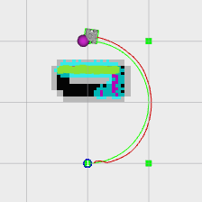

Controller: Pure Pursuit Tuning Guide
=====================================

Description
-----------
Pure pursuit algorithm works by calculating the curvature that will move a vehicle from its current position to some goal position. The main part of the algorithm is to choose a goal position that is some distance ahead of the vehicle on the path. We can think of the vehicle as chasing a point on the path some distance ahead of it - it is pursuing that moving point. This look-ahead distance changes as we drive to reflect the twist of the path.

It is a proportional type controller and follows the global path more accurately. It is computationally fast and is well suited for situations when the robot has to follow a path exactly and doesn’t have to worry about obstacles.

Parameter Description
---------------------

The performance of the pure pursuit controller is highly influenced by its parameters. The following parameters should be tuned for a customized behaviour. 

+------------------------+------------+--------------------------------------------------------------------------------------+
| Parameter              | Units      | Description                                                                          |
+========================+============+======================================================================================+
| min_lookahead          | S.I        | minimum lookahead distance                                                           |
+------------------------+------------+--------------------------------------------------------------------------------------+
| max_lookahead          | S.I        | maximum lookahead distance                                                           |
+------------------------+------------+--------------------------------------------------------------------------------------+
| closest_point_index    | number     | search for closest point index within this range of previous closest point           |
+------------------------+------------+--------------------------------------------------------------------------------------+
| max_acceleration       | S.I        | maximum acceleration                                                                 |
+------------------------+------------+--------------------------------------------------------------------------------------+
| max_velocity           | S.I        | maximum velocity                                                                     |
+------------------------+------------+--------------------------------------------------------------------------------------+
| min_velocity           | S.I        | minimum velocity                                                                     |
+------------------------+------------+--------------------------------------------------------------------------------------+
| max_omega              | S.I        | maximum angular velocity                                                             |
+------------------------+------------+--------------------------------------------------------------------------------------+
| max_radius             | S.I        | maximum radius the robot can take from current to goal pose                          |
+------------------------+------------+--------------------------------------------------------------------------------------+
| min_radius             | S.I        | minimum radius the robot can take from current to goal pose                          |
+------------------------+------------+--------------------------------------------------------------------------------------+
| max_omega_radius       | S.I        | radius set when condition for straight line is satisfied                             |
+------------------------+------------+--------------------------------------------------------------------------------------+
| max_y_deviation        | S.I        | Maximum deviation in the lateral direction                                           |
+------------------------+------------+--------------------------------------------------------------------------------------+
| max_path_deviation     | S.I        | maximum path deviation between current and goal pose                                 |
+------------------------+------------+--------------------------------------------------------------------------------------+
| max_theta_deviation    | S.I        | maximum heading difference                                                           |
+------------------------+------------+--------------------------------------------------------------------------------------+
| transform_tolerance    | S.I        | transform tolerance in seconds for pose in robot frame                               |
+------------------------+------------+--------------------------------------------------------------------------------------+

Files to alter for Tuning
-------------------------

The following files need to be altered and saved for custom parameters to take effect.

1. turtle_mowito
^^^^^^^^^^^^^^^^

+------------------------+---------------------------------------------------------------------------------------------------+
| Pure Pursuit Controller| mowito_ws/src/turtle_mowito/mowito_turtlebot/config/controller_config/pure_pursuit_controller.yaml|
+------------------------+---------------------------------------------------------------------------------------------------+

2. rosbot
^^^^^^^^^

+------------------------+---------------------------------------------------------------------------------------------------+
| Pure Pursuit Controller| mowito_ws/src/gazebo_sim/src/rosbot_description/config/controller/pure_pursuit_controller.yaml    |
+------------------------+---------------------------------------------------------------------------------------------------+

  

Common Problems and Tuning
--------------------------

This section describes certain common problems and describes in more detail how changing parameters will affect the robot behaviour.
::

      TIP use the respective yaml files of the robot to tune the parameters

Initial Check
^^^^^^^^^^^^^
  - Make sure that the maximum acceleration is not set to zero.
  - Make sure that the maximum y deviation is not set to zero.
  - Make sure that the min and max radius are not equal (same for lookahead and  velocities).
  - Make sure that the minimum lookahead distance is in front of the robot. As the size of your robot increases the minimum lookahead distance 	 should increase.
  - Make sure that the path given to the robot does not have any obstacles in its way else the robot might get stuck.

A. Robot is not following the global path accurately when taking a hard turn
^^^^^^^^^^^^^^^^^^^^^^^^^^^^^^^^^^^^^^^^^^^^^^^^^^^^^^^^^^^^^^^^^^^^^^^^^^^^

Pure pursuit controller while taking a turn has to take a minimum radius value for the turn. This is what happens when the robot is asked to take a 90 degree turn. It takes a minimum radius value(here 0.2) to make that quadrant after which it slowly comes back to the global path. Instead, try to give the path to be followed by the robot to have some curvature as this will lead to a much smoother movement i.e follows the global path more accurately(using set_route) and also increase this radius for bigger robots. Example:
  

B. The robot oscillates a lot while approaching a turn
^^^^^^^^^^^^^^^^^^^^^^^^^^^^^^^^^^^^^^^^^^^^^^^^^^^^^^
Make sure that the lookahead goal is in front of the robot and not underneath it. Also, reduce the maximum angular velocity for a smoother motion.

C. The robot is unable/takes more time to follow its path after taking a turn  
^^^^^^^^^^^^^^^^^^^^^^^^^^^^^^^^^^^^^^^^^^^^^^^^^^^^^^^^^^^^^^^^^^^^^^^^^^^^^

Increase the closest point search index to include more number of points to choose from and also check the minimum lookahead goal.
