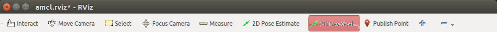

.. _running the rosbot:

==========================
Running the Actual ROSBot
==========================

If have you a Husarion ROSbot you can try out Mowito's Navigation stack directly on it.  

------------------------------
Connect To ROSBot
------------------------------

1. Get the ROSbot connected to a wifi
^^^^^^^^^^^^^^^^^^^^^^^^^^^^^^^^^^^^^^^^^^^
  1.1. Connect a screen and keyboard with ROSBot, and then connect the ROSbot to the wifi.
  
  1.2. Get the Laptop (ground station) on the same network as the ROSbot. This laptop will be used give goals to the ROSbot and visualize the path, sensore input and other info from the ROSbot

2. Get the IP address of the RObot 
^^^^^^^^^^^^^^^^^^^^^^^^^^^^^^^^^^^^^^^
  2.1. Open the terminal
  
  2.2. execute the followin command
      ``hostname -I``
      The output is the IP address of the ROSbot, note it down. 

.. _ssh:

3. SSH into the ROSbot
^^^^^^^^^^^^^^^^^^^^^^^^^^^^^^^^^^^^^^^

  3.1. Open the terminal on your laptop and execute the following
      ``ssh husarion@<ip address of the ROSbot>``

  3.2. If you avahi daemon running on the robot then you can instead try
      ``ssh husarion@husarion.local``\
      where husarion is the user name and hostname of the ROSbot respectively.

4. Export ROS_IP on ROSBot
^^^^^^^^^^^^^^^^^^^^^^^^^^^^^^^^^^^^^^^

  4.1. :ref:`SSH<ssh>` into the ROSbot and execute the following :
      ``export ROS_IP=<ip address of the ROSbot>``

  4.2. If you have avahi daemon  running then you can instead try:
      ``export ROS_IP=husarion.local``

      where husarion is the hostanme of your ROSbot

      You have to execute the above commands every time you ssh into ROSbot to run Mowito's navigation stack.

.. _setup ground station:

5. Setup the Laptop (ground station)
^^^^^^^^^^^^^^^^^^^^^^^^^^^^^^^^^^^^^^^

  5.1. Export ROS_IP
      Get the IP address of the laptop, by executing the following on the laptop's terminal
      ``hostname -I``

      then on the same terminal
      ``export ROS_IP=<ip address of the laptop>``

  5.2. Export ROS_MASTER_URI
      One same terminal execute the following:
      ``export ROS_MASTER_URI=http://<ip address of the ROSbot>:11311``

      You have execute above two commans on each terminal of Laptop (Ground station) which you want to use for communicating to the ROSbot.

-------------------------------
Setup Mowito's Stack On Robot
-------------------------------

User Registration
^^^^^^^^^^^^^^^^^

If you have already done, you can skip this step.

Register yourself on this website https://mowito.in/navigation_stack.html

We need your email to mail you the password, and to count how many people are using Mowito.

We won't spam. :) 

.. _installion on rosbot:

Installation Mowito Navigation Stack 
^^^^^^^^^^^^^^^^^^^^^^^^^^^^^^^^^^^^^^

  1. :ref:`SSH<ssh>` into the ROSBot
      

  2. Create mowito directory
      ``mkdir -p ~/mowito_ws/src/``\

  3. Clone the repo containing the debians:
      ``cd ~/mowito_ws/src``\

      for ROS melodic on arm 64 
      ``git clone https://github.com/mowito/mowito_arm64.git --branch melodic``

      for ROS kinetic on armV7 (armhf) \
      ``git clone https://github.com/mowito/mowito_armv7.git --branch kinetic``

  4. Remove any previous installation of Mowito stack 
      ``cd mowito_arm64`` or ``cd mowito_armv7``   based on arm 64 or armV7 respcectively.

      for ROS melodic
      ``./remove_mowito.sh melodic``

      for ROS kinetic
      ``./remove_mowito.sh kinetic``    

  5. Install the new Mowito stack 
      For ROS melodic
      ``./setup_mowito.sh melodic``\

      For ROS kinetic
      ``./setup_mowito.sh kinetic``\

  6. In the end, the setup will ask for the uesr registeration.
      Use the user name you used on the registration website and password that was mailed to  you. You can use any name as robot name.

Installation of Mowito Rosbot Package 
^^^^^^^^^^^^^^^^^^^^^^^^^^^^^^^^^^^^^^
Mowito Rosbot package simply contains the necessary launch files and config files, which Mowito team create for easy deployment on ROSbot.

  1. :ref:`SSH<ssh>` into the ROSBot

  2. clone the Mowito ROSbot package into the mowito_ws

    ``cd ~/mowito_ws/src && git clone https://github.com/mowito/mowito_rosbot.git``

  3. Build the Mowito ROSbot package.

    ``cd ~/mowito_ws && catkin_make``

    of if you use catkin build tools

    ``cd ~/mowito_ws && catkin build``

  4. source the mowito_ws whenever you need to run mowito_rosbot

    ``source ~/mowito_ws/devel/setup.bash``

    TIP:: you can add the above command in you ``~/.bashrc`` so that its atuomatically executed everytime you open the terminal.

-------------------------------
Navigation - Without Map 
-------------------------------

During this phase, for navigation the robot, you can use two methods

1. Manual Navigation - Using Tele-Operation
2. Autonomou Navigation - By giving goals through Rviz

Method 1 : Manual Navigation
^^^^^^^^^^^^^^^^^^^^^^^^^^^^^^

Step 0 : :ref:`SSH<ssh>` into the rosbot and on it source the workspace
~~~~~~~~~~~~~~~~~~~~~~~~~~~~~~~~~~~~~~~~~~~~~~~~~~~~~~~~~~~~~~~~~~~~~~~~~~~~~~~~~~~~~~

    ``ssh husarion@husarion.local`` 

    ``source ~/mowito_ws/devel/setup.bash``

Step 1 : Launch the sim_mw_mapping node
~~~~~~~~~~~~~~~~~~~~~~~~~~~~~~~~~~~~~~~~~~~~~~
    1.  With Mowito Mapping (default)

    ``roslaunch mowito_rosbot run_mw_mapping.launch``
    
    2. With cartographer
    
    ``roslaunch mowito_rosbot run_mw_mapping.launch cartographer:=true``
    
    .. 3. With Slamtoolbox

Step 2 : Launch the remote control for providing commands to the bot
~~~~~~~~~~~~~~~~~~~~~~~~~~~~~~~~~~~~~~~~~~~~~~~~~~~~~~~~~~~~~~~~~~~~~~~~~~~~~~
in another terminal, :ref:`SSH<ssh>` in into rosbot and run the following command :

    ``rosrun teleop_twist_keyboard teleop_twist_keyboard``

Method 2 : Autonomous Navigation
^^^^^^^^^^^^^^^^^^^^^^^^^^^^^^^^^

Here, the robot will explore the map based on the goal destination provided by the user on RViz.

Step 0 : :ref:`SSH<ssh>` into the rosbot and on it source the workspace
~~~~~~~~~~~~~~~~~~~~~~~~~~~~~~~~~~~~~~~~~~~~~~~~~~~~~~~~~~~~~~~~~~~~~~~~~~~~~~~~~~~~~~

    ``ssh husarion@husarion.local`` 

    ``source ~/mowito_ws/devel/setup.bash``

Step 1 : Launch the Mowito Navigation without Map
~~~~~~~~~~~~~~~~~~~~~~~~~~~~~~~~~~~~~~~~~~~~~~~~~~~~~~~~~~~~

    1. With Mowito mapping.

    ``roslaunch mowito_rosbot run_mw_navigation_with_no_map.launch``

    2. With Cartographer

    ``roslaunch mowito_rosbot run_mw_navigation_with_no_map.launch cartographer:=true``

Step 2: Provide Goal
~~~~~~~~~~~~~~~~~~~~~~~~~~~~~~~~~~~~~~~~~~~~
    
    Open another terminal, export :ref:`ROS_MASTER_URI and ROS_IP<setup ground station>` and then source ROS and :ref:``start rviz<rviz>``:

    ``rviz``

    The goal can be provided on RViz using the "2D Nav Goal" feature provided on RViz.

The icon is highlighted in red in the image below.

Saving the Map
^^^^^^^^^^^^^^^

Once you are done creating the map on rviz, for saving the map on a new terminal, **ssh into rosbot** and based on the mapping tool you were using execute the following command:

1) Mowito Mapping (defautl)
~~~~~~~~~~~~~~~~~~~~~~~~~~~~~~~~~~~~~~~~~~~~

    ``cd && rosrun map_server map_saver -f mymap``
            
the map (pgm and yaml) is saved  in the home directory with the name mymap.pgm and mymap.yaml

2) Cartographer , run the following command
~~~~~~~~~~~~~~~~~~~~~~~~~~~~~~~~~~~~~~~~~~~~

    ``rosrun mowito_rosbot save_carto_map.sh map_name``
   
    the map (pbstream) is saved in the home directory with the name map_name.pbstream. If no map_name is given then it would save as map.pbstream

.. 3) SLAM toolbox
.. ~~~~~~~~~~~~~~~~~

.. in order to save the map,

..         ``rosservice call /slam_toolbox/serialize_map "rosbot"``

-----------------------------------
Navigation - With Map 
-----------------------------------

Step 0 : :ref:`SSH<ssh>` into ROSBot and Source the workspace
^^^^^^^^^^^^^^^^^^^^^^^^^^^^^^^^^^^^^^^^^^^^^^^^^^^^^^^^^^^^^^^^^^

    ``source <path_to_mowito_ws>/devel/setup.bash``

Step 1 : Place the robot
^^^^^^^^^^^^^^^^^^^^^^^^^^^^^^^^^^^^^^^^^^^^^^^^^^^^^^^^^^^^

    Preferable place the robot at the origin of map (the place where you started mapping)

Step 2 : Run the Mowito's Navigation Stack
^^^^^^^^^^^^^^^^^^^^^^^^^^^^^^^^^^^^^^^^^^^^^^^^^^^^^^^^^^^^

    Open a terminal and SSH into the ROSBOT

1. Using map made from Mowito Mapping (in previous step) 
~~~~~~~~~~~~~~~~~~~~~~~~~~~~~~~~~~~~~~~~~~~~~~~~~~~~~~~~~~~~~~~

      ``roslaunch mowito_rosbot run_mw_navigation.launch``

      If you want to use the map created in the previous section use the following command
 
      ``roslaunch mowito_rosbot sim_mw_navigation.launch map_path:=/home/husarion/mymap.yaml``

2. Cartographer based Localization 
~~~~~~~~~~~~~~~~~~~~~~~~~~~~~~~~~~~~~~~~~~~~~~~~~~~~~~~~~~~~~~~

      Use this if you created the map from cartographer in the previous step    

      ``roslaunch mowito_rosbot run_mw_navigation.launch cartographer:=true``

.. 3. SLAM toolbox based localization
.. ~~~~~~~~~~~~~~~~~~~~~~~~~~~~~~~~~~~~~~~~~~~~~~~~~~~~~~~~~~~~~~~

..     Follow this if you used SLAM toolbox to create the map in the previous step

..       3.1. move the map data to .ros folder in your system by running the following two commands:

..        ``cd <path_to_mowito_ws>/src/mowito_husky/husky/mowito_husky/maps/``

..        ``cp husky_serialize.data husky_serialize.posegraph ~/.ros/``
    
..       3.2. set the name of the map file and map start pose [x,y,theta] in mowito_ws/src/mowito_husky/husky/mowito_husky/config/slam_toolbox_config/slam_toolbox_localization.yaml:

..        ``map_file_name: husky_serialize``

..        ``map_start_pose: [0.0, 0.0, 0.0]``
    
..       3.3. run slam toolbox for mapping/ SLAM with velodyne:
    
..        ``roslaunch mowito_husky sim_mw_navigation_slam_toolbox.launch``

Step 3 : Give the goals
^^^^^^^^^^^^^^^^^^^^^^^^^^^^^^^^^^^^^^^^^^^^^^^^^^^^^^^^^^^^

    In another terminal, export the :ref:`ROS_MASTER_URI and ROS_IP<setup ground station>`, source ros and :ref:``start rviz<rviz>``:

    ``rviz``
    
    In the rviz, click on the second top panel, click on the nav goal option, and click on the displayed map to give goal to the robot.

-------------------------------------
Configuring Navigation Stack
-------------------------------------

Check out our :ref:`documentation on configuring Mowito Navigation Stack<config>` on a robot.

.. _rviz:
-------------------------------------
Setting Up Rviz
-------------------------------------

Rviz is a tool for visualizing what the robot is seeing. Further, it could also provide GUI for the user to interact with the robot. Rviz can be opened in the computer (with screen) - most probably not the ROSbot, using the command ``rviz``(after sourcing ROS).

In order to visualize all the interesting information on Rviz you have to add the topics on which they are getting published. You can find more information on this http://wiki.ros.org/rviz/UserGuide

To add a topic of visualisation:

1. On the left "Display" pane, click on "add"
2. Click on "by topic"
3. select the topic name
4. click on "ok"

now you one-by-one you have to add the following topics:
``scan`` ``/map`` ``/plan`` ``/costmap/local_costmap/footprint`` ``/free_paths`` ``/local_path`` 

for visualizing the axis of the robot and other frames:

1. On the left "Display" pane, click on "add"
2. Click on "by display"
3. select "axes"
4. click on "ok"