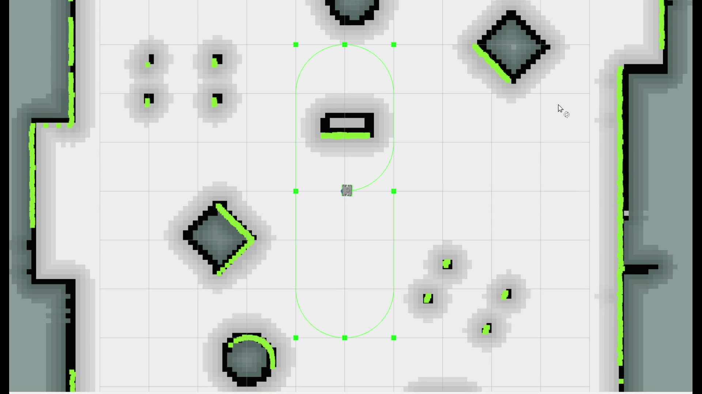

Route based Navigation  
===========================================

Overview
-------------------------------------
	- In addition to the waypoint navigation feature in simulation, one can also simulate the robot by giving route points via route.yaml (type) file. 
	- This feature provides user the ability to give pre-planned goals.
	- There are two ways for using this feature. We will be using the example of husky robot simulation to explain this:

.. NOTE::

      While using this feature, it is highly recommended that one uses the **genroute** planner for optimal results. 
 
There are two ways to go about using Rotues, based on when the user wants to change the planner types.

A. Selecting the type of (Global) Planner  before launching the stack
^^^^^^^^^^^^^^^^^^^^^^^^^^^^^^^^^^^^^^^^^^^^^^^^^^^^^^^^^^^^^^^^^^^^^^^^^^^^^^^^^^^
   1. Open the mission_executive_params.yaml file located inside the `mowito_husky/husky/mowito_husky/config/mission_executive_config` folder of the mowito_husky package.

   2. Change the planner tag to ``genroute``.

   3. Now, lets run navigation with map:
                  
      ``roslaunch mowito_husky sim_mw_navigation.launch``

   4. In a new terminal, run the set_route_client node with the appropriate file path to the route.yaml (type) file. Sample route files are available in the samples folder of the mowito_husky package:
                  
      ``rosrun executive set_route_client path/to/route/file``     

   
B. Changing the (Global) Planner during the run (after launching the stack)
^^^^^^^^^^^^^^^^^^^^^^^^^^^^^^^^^^^^^^^^^^^^^^^^^^^^^^^^^^^^^^^^^^^^^^^^^^^^^^^^^^^
   1. Lets run navigation with map:
      
      ``roslaunch mowito_husky sim_mw_navigation.launch``

   2. Use the change_planner and change_controller services to change the planner and controller respectively. For this, in a new terminal, execute:  
   
      ``rosservice call /mission_executive/change_planner genroute``

   4. Now, in a new terminal, run the set_route_client node with the appropriate file path to the route.yaml (type) file. Sample route files are available in the samples folder of the mowito_husky package:
                  
      ``rosrun executive set_route_client path/to/route/file``

*Example: rosbot following a given route*

