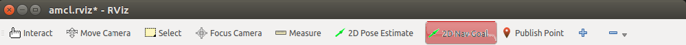
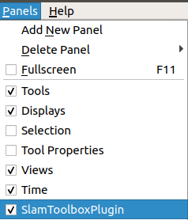
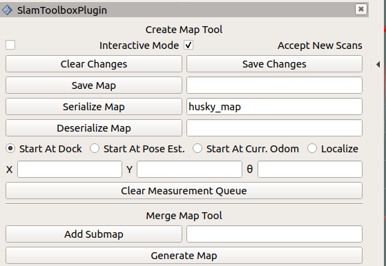

=======================
Step 3 : Generate a Map
=======================

The Mowito Navigation Stack provides three methods to generate a map.

------------------------------
Mapping for Simulation Pursose
------------------------------

Method 1 : Manual Map generation via remote control robot exploration
^^^^^^^^^^^^^^^^^^^^^^^^^^^^^^^^^^^^^^^^^^^^^^^^^^^^^^^^^^^^^^^^^^^^^

**Step 0 : Source the workspace**

    ``source <path_to_mowito_ws>/devel/setup.bash``

**Step 1 : Launch the sim_mw_mapping node**

*For ROSBot, run the following command*

    ``roslaunch mowito_rosbot sim_mw_mapping.launch``

*For TurtleBot, run the following commands*

    ``roslaunch turtlebot3_gazebo turtlebot3_world.launch``

    In another terminal, run the following commands:

    ``export TURTLEBOT3_MODEL=waffle_pi``

    ``roslaunch mowito_turtlebot turtle_mowito_mapping.launch``

*For Husky, run the following command*

    ``roslaunch mowito_husky sim_mw_mapping.launch``

*For Jackal, run the following command*

    ``roslaunch mowito_jackal jackal_mw_mapping.launch`` 

**Step 2 : Launch the remote control for providing commands to the bot**

in another terminal, run the following command :

    ``rosrun teleop_twist_keyboard teleop_twist_keyboard.py``

Method 2 : Map generation by providing goal destination for navigating robot for exploration
^^^^^^^^^^^^^^^^^^^^^^^^^^^^^^^^^^^^^^^^^^^^^^^^^^^^^^^^^^^^^^^^^^^^^^^^^^^^^^^^^^^^^^^^^^^^

Here, the robot will explore the map based on the goal destination provided by the user on RViz.

*For ROSBot, run the following command*

    ``roslaunch mowito_rosbot sim_mw_navigation_with_no_map.launch``

*For TurtleBot, run the following command*

    ``roslaunch turtlebot3_gazebo turtlebot3_world.launch``

    In another terminal, run the following commands:

    ``export TURTLEBOT3_MODEL=waffle_pi``

    ``roslaunch mowito_turtlebot turtle_mowito_nav_no_map.launch``

*For Husky, run the following command*

     ``roslaunch mowito_husky sim_mw_navigation_with_no_map.launch``

    For using cartographer for mapping/ SLAM instead of default mw_mapping, use the following commad:
    
     ``roslaunch mowito_husky sim_mw_navigation_with_no_map.launch cartographer:=true``

    For using slam toolbox for mapping/ SLAM with velodyne, use the following commad:

     ``roslaunch mowito_husky sim_mw_navigation_with_no_map_slam_toolbox.launch``

*For Jackal, run the following command*

    ``roslaunch mowito_jackal jackal_mw_nav_no_map.launch``

The goal can be provided on RViz using the "2D Nav Goal" feature provided on RViz.

The icon is highlighted in red in the image below.

Saving the Map
^^^^^^^^^^^^^^

Once you are done creating the map on rviz, save the map on a new terminal exeute the following:
         
    ``cd && rosrun map_server map_saver -f mymap``
            
the map (pgm and yaml) is saved  in the home directory with the name mymap.pgm and mymap.yaml

*For Huskybot*

1) if you were using cartographer to build the map , run the following command

    ``rosrun mowito_husky save_carto_map.sh map_name``
   
   the map (pbstream) is saved in the home directory with the name map_name.pbstream. If no map_name is given then it would save as map.pbstream
2) if you were using slam toolbox to build the map, open the slam toolbox plugin in Rviz by clicking the panels and give a name for the map and store it using serialize map option.

   

  
the map is saved in the .ros folder in the home directory with the name husky_map.posegraph and husky_map.data.

Alternatively, in order to save the map, on a new terminal execute the following:

        ``rosservice call /slam_toolbox/serialize_map "husky_serialize"``
