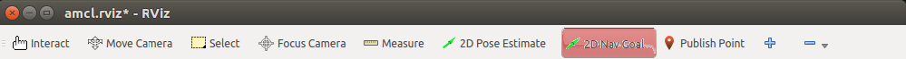

=======================
Step 3 : Generate a Map
=======================

The Mowito Navigation Stack provides three methods to generate a map.

------------------------------
Mapping for Simulation Pursose
------------------------------

Method 1 : Manual Map generation via remote control robot exploration
^^^^^^^^^^^^^^^^^^^^^^^^^^^^^^^^^^^^^^^^^^^^^^^^^^^^^^^^^^^^^^^^^^^^^

**Step 1 : Launch the sim_mw_mapping node**

*For ROSBot, run the following command*

    ``roslaunch mowito_rosbot sim_mw_mapping.launch``

*For TurtleBot, run the following command*

    ``roslaunch mowito_turtlebot sim_mw_mapping.launch``

*For HuskyBot, run the following command*

    ``roslaunch mowito_huskybot sim_mw_mapping.launch``

**Step 2 : Launch the remote control for providing commands to the bot**

in another terminal, run the following command :

    ``rosrun teleop_twist_keyboard teleop_twist_keyboard``

Method 2 : Map generation by providing goal destination for navigating robot for exploration
^^^^^^^^^^^^^^^^^^^^^^^^^^^^^^^^^^^^^^^^^^^^^^^^^^^^^^^^^^^^^^^^^^^^^^^^^^^^^^^^^^^^^^^^^^^^

Here, the robot will explore the map based on the goal destination provided by the user on RViz.

*For ROSBot, run the following command*

    ``roslaunch mowito_rosbot sim_mw_navigation_with_no_map.launch``

*For TurtleBot, run the following command*

    ``roslaunch mowito_turtlebot sim_mw_navigation_with_no_map.launch``

*For HuskyBot, run the following command*

     ``roslaunch mowito_huskybot sim_mw_navigation_with_no_map.launch``
   

The goal can be provided on RViz using the "2D Nav Goal" feature provided on RViz.

The icon is highlighted in red in the image below.

Method 3 : Map generation by autonomous robot exploration
^^^^^^^^^^^^^^^^^^^^^^^^^^^^^^^^^^^^^^^^^^^^^^^^^^^^^^^^^

Here, the robot will explore the map without user interference.

*For ROSBot, run the following command*

    ``roslaunch mowito_rosbot sim_mw_mapping_with_explore.launch``

*For TurtleBot, run the following command*

    ``roslaunch mowito_turtlebot sim_mw_mapping_with_explore.launch``

*For HuskyBot, run the following command*

    ``roslaunch mowito_huskybot sim_mw_mapping_with_explore.launch``
   
on rviz you can see the robot automatically moving and exploring the area.

Saving the Map
^^^^^^^^^^^^^^

Once you are done creating the map on rviz, save the map on a new terminal exeute the following:
         
    ``cd && rosrun map_server map_saver -f mymap``
            
the map (pgm and yaml) is saved  in the home directory with the name mymap.pgm and mymap.yaml
