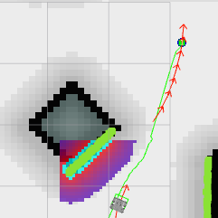

======================================================
Part 5-C : Controller - Teb Local Planner Tuning Guide
======================================================

Description
-----------
Teb implements an online optimal local trajectory planner for navigation and control of mobile robots. The initial trajectory generated by a global planner is optimized during runtime w.r.t. minimizing the trajectory execution time (time-optimal objective), separation from obstacles and compliance with kinodynamic constraints such as satisfying maximum velocities and accelerations.

The optimal trajectory is efficiently obtained by solving a sparse scalarized multi-objective optimization problem. The user can provide weights to the optimization problem in order to specify the behavior in case of conflicting objectives.

Since local planners such as the Timed-Elastic-Band get often stuck in a locally optimal trajectory as they are unable to transit across obstacles, an extension is implemented. A subset of admissible trajectories of distinctive topologies is optimized in parallel. The local planner is able to switch to the current globally optimal trajectory among the candidate set. Distinctive topologies are obtained by utilizing the concept of homology / homotopy classes.

Parameter Description
---------------------

The teb_local_planner package allows the user to set parameters in order to customize the behavior. These parameters are grouped into several categories: robot configuration, goal tolerance, trajectory configuration, obstacles, optimization, planning in distinctive topologies and miscellaneous parameters.

1. Trajectory Configuration Parameters
^^^^^^^^^^^^^^^^^^^^^^^^^^^^^^^^^^^^^^
+-----------------------------------+------------+---------------------------------------------------------------------------+
| Parameter                         | Values     | Description                                                               |
+===================================+============+===========================================================================+
| teb_autosize                      | true/false | If set to true automatic resizing occurs                                  |
+-----------------------------------+------------+---------------------------------------------------------------------------+
| dt_ref                            | number     | Desired temporal resolution of the trajectory (the trajectory is not fixed|
|                                   | 	         | to dt_ref since the temporal resolution is part of the optimization, but  |
|                                   |            | the trajectory will be resized between iterations if dt_ref               |
|                                   |            | +-dt_hysteresis is violated.                                              |
+-----------------------------------+------------+---------------------------------------------------------------------------+
| dt_hysteresis                     | number     | Hysteresis for automatic resizing depending on the current temporal       |
|                                   |            | resolution, usually approx 10% of dt_ref is recommended                   |
+-----------------------------------+------------+---------------------------------------------------------------------------+
| global_plan_overwrite_orientation | true/false | Overwrite orientation of local subgoals provided by the global planner    |
|                                   |            | (since they often provide only a 2D path)                                 |
+-----------------------------------+------------+---------------------------------------------------------------------------+
| max_global_lookahead_dist         | S.I        | Specify the maximum length (cumulative Euclidean distances) of the subset |
|                                   |            | of the global plan taken into account for optimization. The actual length |
|                                   |            | is then determined by the logical conjunction of the local costmap size   |
|                                   |            | and this maximum bound. Set to zero or negative in order to deactivate    |
|                                   |            | this limitation.                                                          | 
+-----------------------------------+------------+---------------------------------------------------------------------------+
| feasibility_check_no_poses        | number     | Specify up to which pose on the predicted plan the feasibility should be  |
|                                   |            | checked each sampling interval.                                           |
+-----------------------------------+------------+---------------------------------------------------------------------------+
| min_samples                       | number     | Minimum number of samples( always greater than 2)                         |
+-----------------------------------+------------+---------------------------------------------------------------------------+
| max_samples                       | number     | Maximum number of samples                                                 |
+-----------------------------------+------------+---------------------------------------------------------------------------+

2. Robot Configuration Parameters
^^^^^^^^^^^^^^^^^^^^^^^^^^^^^^^^^
+------------------------+------------+--------------------------------------------------------------------------------------+
| Parameter              | Units      | Description                                                                          |
+========================+============+======================================================================================+
| max_vel_x              | S.I        | Maximum translational velocity of the robot                                          |
+------------------------+------------+--------------------------------------------------------------------------------------+
| max_vel_x_backwards    | S.I        | Maximum absolute translational velocity of the robot while moving backwards          |
+------------------------+------------+--------------------------------------------------------------------------------------+
| max_vel_theta          | S.I        | Maximum angular velocity of the robot                                                |
+------------------------+------------+--------------------------------------------------------------------------------------+
| acc_lim_x              | S.I        | Maximum translational acceleration of the robot                                      |
+------------------------+------------+--------------------------------------------------------------------------------------+
| acc_lim_theta          | S.I        | Maximum angular acceleration of the robot                                            |
+------------------------+------------+--------------------------------------------------------------------------------------+
| min_turning_radius     | S.I        | Maximum turning radius of a car like robot (set to zero for diff-drive robot)        |
+------------------------+------------+--------------------------------------------------------------------------------------+

3. Robot Footprint Parameters
^^^^^^^^^^^^^^^^^^^^^^^^^^^^^
+-----------------------------------+------------+---------------------------------------------------------------------------+
| Parameter                         | Values     | Description                                                               |
+===================================+============+===========================================================================+
| type                              | point,     | Type of robot                                                             |
|                                   | circular,  |                                                                           |
|                                   | two_circles|                                                                           |
|		                    | ,line,     |                                                                           |
|				    | polygon    |                                                                           |
+-----------------------------------+------------+---------------------------------------------------------------------------+
| radius                            | Numeric    | Radius for circular robot                                                 |
|                                   | eg. 0.2	 |                                                                           |
+-----------------------------------+------------+---------------------------------------------------------------------------+
| line_start                        | Eg. [-0.3, | It contains the start coordinates of the line segment for type "line"     |
|                                   | 0.0]       |                                                                           |
+-----------------------------------+------------+---------------------------------------------------------------------------+
| line_end                          | Eg. [0.3,  | It contains the end coordinates of the line segment for type "line"       |
|                                   | 0.0]       |                                                                           |
+-----------------------------------+------------+---------------------------------------------------------------------------+
| front_offset                      | Numeric    | It describes how much the center of the font circle is shifted along the  |
|                                   | eg. 0.2    | robot's x-axis. The robot's axis of rotation is assumed to be located at  |
|                                   |            | [0,0] for type "two_circles"                                              | 
+-----------------------------------+------------+---------------------------------------------------------------------------+
| front_radius                      | Numeric    | Contains the radius of the front circle for type "two_circles"            |
|                                   | eg. 0.2    |                                                                           |
+-----------------------------------+------------+---------------------------------------------------------------------------+
| rear_offset                       | Numeric    | It describes how much the center of the font circle is shifted along the  |
|                                   | eg. 0.2    | robot's negative x-axis. The robot's axis of rotation is assumed to be    |
|                                   |            | located at [0,0] for type "two_circles"                                   | 
+-----------------------------------+------------+---------------------------------------------------------------------------+
| rear_radius                       | Numeric    | Contains the radius of the front circle for type "two_circles"            |
|                                   | eg. 0.2    |                                                                           |
+-----------------------------------+------------+---------------------------------------------------------------------------+
| vertices                          | Eg.[[0.1,  | It contains the list of polygon vertices (2D coordinates each). The       |
|                                   | 0.1],[0.1, | polygon is always closed: do not repeat the first vertex at the end for   |
|                                   | -0.1],[-0.1| type "polygon"                                                            |
|                                   | ,-0.1],[-0.|                                                                           |
|                                   | 1,0.1]]    |                                                                           |
+-----------------------------------+------------+---------------------------------------------------------------------------+

4. Goal Tolerance Parameters
^^^^^^^^^^^^^^^^^^^^^^^^^^^^

+------------------------+------------+--------------------------------------------------------------------------------------+
| Parameter              | Units      | Description                                                                          |
+========================+============+======================================================================================+
| xy_goal_tolerance      | S.I        | Maximum allowable deviation in robot position from the goal position.                |
+------------------------+------------+--------------------------------------------------------------------------------------+
| yaw_goal_tolerance     | S.I        | Specifies the maximum allowable angular deviation in the robot orientation from the  |
|                        |            | goal orientation.                                                                    |
+------------------------+------------+--------------------------------------------------------------------------------------+
| free_goal_vel          | true/false | when set to false removes the goal velocity constraint such that the robot can arrive|
|                        |            | at the goal with maximum velocity.                                                   |
+------------------------+------------+--------------------------------------------------------------------------------------+

5. Obstacle Parameters
^^^^^^^^^^^^^^^^^^^^^^

+------------------------------------+------------+--------------------------------------------------------------------------------------+
| Parameter                          | Values     | Description                                                                          |
+====================================+============+======================================================================================+
| min_obstacle_dist                  | S.I        | Minimum desired separation from obstacles in meters                                  |
+------------------------------------+------------+--------------------------------------------------------------------------------------+
| include_costmap_obstacles          | true/false | Specify if obstacles of the local costmap should be taken into account. Each cell    | 
|                                    |            | that is marked as an obstacle is considered as a point-obstacle. Therefore do not    | 
|                                    |            | choose a very small resolution of the costmap since it increases computation time.   |
+------------------------------------+------------+--------------------------------------------------------------------------------------+
| costmap_obstacles_behind_robot_dist| S.I        | Limit the occupied local costmap obstacles taken into account for planning behind the|
|                                    |            | robot (specify distance in meters)                                                   | 
+------------------------------------+------------+--------------------------------------------------------------------------------------+
| obstacle_poses_affected            | number     | Each obstacle position is attached to the closest pose on the trajectory in order to | 
|                                    |            | keep a distance. Additional neighbors can be taken into account as well. Default     |
|                                    |            | value is 30                                                                          |
+------------------------------------+------------+--------------------------------------------------------------------------------------+
| costmap_converter_plugin           | string     | Define plugin name in order to convert costmap cells to points/lines/polygons. Set an|
|                                    |            | empty string to disable the conversion such that all cells are treated as            | 
|                                    |            | point-obstacles.                                                                     |
+------------------------------------+------------+--------------------------------------------------------------------------------------+
| costmap_converter_spin_thread      | true/false | If set to true, the costmap converter invokes its callback queue in a different      | 
|                                    |            | thread.                                                                              |
+------------------------------------+------------+--------------------------------------------------------------------------------------+
| costmap_converter_rate             | number(Hz) | Rate that defines how often the costmap_converter plugin processes the current       |
|                                    |            | costmap (the value should not be much higher than the costmap update rate) [in Hz]   |
+------------------------------------+------------+--------------------------------------------------------------------------------------+

6. Optimization Parameters
^^^^^^^^^^^^^^^^^^^^^^^^^^

+------------------------------------+------------+--------------------------------------------------------------------------------------+
| Parameter                          | Values     | Description                                                                          |
+====================================+============+======================================================================================+
| no_inner_iterations                | number     | Number of actual solver iterations called in each outer loop iteration. See param    | 
|                                    |            | no_outer_iterations.                                                                 |
+------------------------------------+------------+--------------------------------------------------------------------------------------+
| no_outer_iterations                | number     | Each outer loop iteration automatically resizes the trajectory according to the      | 
|                                    |            | desired temporal resolution dt_ref and invokes the internal optimizer (that performs | 
|                                    |            | no_inner_iterations). The total number of solver iterations in each planning cycle is| 
|                                    |            | therefore the product of both values.                                                |
+------------------------------------+------------+--------------------------------------------------------------------------------------+
| optimization_activate              | true/false | Set to true for activating optimization                                              | 
+------------------------------------+------------+--------------------------------------------------------------------------------------+
| optimization_verbose               | true/false | Print the optimization steps                                                         | 
+------------------------------------+------------+--------------------------------------------------------------------------------------+
| penalty_epsilon                    | number     | Add a small safety margin to penalty functions for hard-constraint approximations    |
+------------------------------------+------------+--------------------------------------------------------------------------------------+
| weight_max_vel_x                   | number     | Optimization weight for satisfying the maximum allowed translational velocity        |
+------------------------------------+------------+--------------------------------------------------------------------------------------+
| weight_max_vel_theta               | number     | Optimization weight for satisfying the maximum allowed angular velocity              |
+------------------------------------+------------+--------------------------------------------------------------------------------------+
| weight_acc_lim_x                   | number     | Optimization weight for satisfying the maximum allowed translational acceleration    |
+------------------------------------+------------+--------------------------------------------------------------------------------------+
| weight_acc_lim_theta               | number     | Optimization weight for satisfying the maximum allowed angular acceleration          |
+------------------------------------+------------+--------------------------------------------------------------------------------------+
| weight_kinematics_nh               | number     | Optimization weight for satisfying the non-holonomic kinematics (this parameter must |
|                                    |            | be high since the kinematics equation constitutes an equality constraint, even a     | 
|                                    |            | value of 1000 does not imply a bad matrix condition due to small 'raw' cost values in| 
|                                    |            | comparison to other costs).                                                          |
+------------------------------------+------------+--------------------------------------------------------------------------------------+
| weight_kinematics_forward_drive    | number     | Optimization weight for forcing the robot to choose only forward directions          | 
|                                    |            | positive transl. velocities). A small weight (e.g. 1.0) still allows driving         | 
|                                    |            | backwards. A value around 1000 almost prevents backward driving (but cannot be       |  
|                                    |            | guaranteed).                                                                         |
+------------------------------------+------------+--------------------------------------------------------------------------------------+
| weight_kinematics_turning_radius   | number     | Optimization weight for enforcing a minimum turning radius (only for car like robots)|
+------------------------------------+------------+--------------------------------------------------------------------------------------+
| weight_optimaltime                 | number     | Optimization weight for contracting the trajectory w.r.t transition/execution time   |
+------------------------------------+------------+--------------------------------------------------------------------------------------+
| weight_obstacle                    | number     | Optimization weight for keeping a minimum distance from obstacles                    |
+------------------------------------+------------+--------------------------------------------------------------------------------------+

7. Homotopy Parameters
^^^^^^^^^^^^^^^^^^^^^^

+------------------------------------+------------+--------------------------------------------------------------------------------------+
| Parameter                          | Values     | Description                                                                          |
+====================================+============+======================================================================================+
| enable_homotopy_class_planning     | true/false | Activate parallel planning in distinctive topologies (requires much more CPU         | 
|                                    |            | resources)                                                                           |
+------------------------------------+------------+--------------------------------------------------------------------------------------+
| enable_multithreading              | true/false | Activate multiple threading in order to plan each trajectory in a different thread   |
+------------------------------------+------------+--------------------------------------------------------------------------------------+
| simple_exploration                 | true/false | to use it for exploration set value to true                                          |
+------------------------------------+------------+--------------------------------------------------------------------------------------+
| max_number_classes                 | number     | Specify the maximum number of distinctive trajectories taken into account (limits    |    
|                                    |            | computational effort)                                                                |
+------------------------------------+------------+--------------------------------------------------------------------------------------+
| roadmap_graph_no_samples           | number     | Specify the number of samples generated for creating the roadmap graph               |
+------------------------------------+------------+--------------------------------------------------------------------------------------+
| roadmap_graph_area_width           | S.I        | Random waypoints are sampled in a rectangular region between start and goal. Specify | 
|                                    |            | the width of that region in meters.                                                  |
+------------------------------------+------------+--------------------------------------------------------------------------------------+
| h_signature_prescaler              | number     | Scale internal parameter (H-signature) that is used to distinguish between homotopy  |  
|                                    |            | classes. Warning: reduce this parameter only, if you observe problems with too many  |  
|                                    |            | obstacles in the local cost map, do not choose it extremely low, otherwise obstacles |
|                                    |            | cannot be distinguished from each other (0.2<value<=1).                              |
+------------------------------------+------------+--------------------------------------------------------------------------------------+
| h_signature_threshold              | number     | Two H-signatures are assumed to be equal, if both the difference of real parts and   | 
|                                    |            | complex parts are below the specified threshold.                                     |
+------------------------------------+------------+--------------------------------------------------------------------------------------+
| obstacle_heading_threshold         | number     | Specify the value of the scalar product between obstacle heading and goal heading in | 
|                                    |            | order to take them (obstacles) into account for exploration.                         |
+------------------------------------+------------+--------------------------------------------------------------------------------------+
| visualize_hc_graph                 | true/false | Visualize the graph that is created for exploring distinctive trajectories.          |
+------------------------------------+------------+--------------------------------------------------------------------------------------+

8. Miscellaneous Parameters
^^^^^^^^^^^^^^^^^^^^^^^^^^^

+------------------------------------+------------+--------------------------------------------------------------------------------------+
| Parameter                          | Values     | Description                                                                          |
+====================================+============+======================================================================================+
| Odom_topic                         | Eg. /odom  | Topic name of the odometry message                                                   |
+------------------------------------+------------+--------------------------------------------------------------------------------------+
| map_frame                          | Eg. /map   | Global planning frame                                                                |
+------------------------------------+------------+--------------------------------------------------------------------------------------+

Files to alter for Tuning
-------------------------

The following files need to be altered and saved for custom parameters to take effect.

1. turtle_mowito
^^^^^^^^^^^^^^^^

+------------------------+---------------------------------------------------------------------------------------------------+
| Teb local planner      | mowito_ws/src/turtle_mowito/mowito_turtlebot/config/controller_config/teb_local_planner_ros.yaml  |
+------------------------+---------------------------------------------------------------------------------------------------+
| Local Costmap          | mowito_ws/src/turtle_mowito/mowito_turtlebot/config/costmap_config/local_costmap_params.yaml      |
+------------------------+---------------------------------------------------------------------------------------------------+
| Global Costmap         | mowito_ws/src/turtle_mowito/mowito_turtlebot/config/costmap_config/global_costmap_params.yaml     |
+------------------------+---------------------------------------------------------------------------------------------------+

2. rosbot
^^^^^^^^^

+------------------------+---------------------------------------------------------------------------------------------------+
| Teb local planner      | mowito_ws/src/gazebo_sim/src/rosbot_description/config/controller/teb_local_planner_ros.yaml      |
+------------------------+---------------------------------------------------------------------------------------------------+
| Local Costmap          | mowito_ws/src/costmap2d/config/local_costmap_params.yaml                                          |
+------------------------+---------------------------------------------------------------------------------------------------+
| Global Costmap         | mowito_ws/src/costmap2d/config/global_costmap_params.yaml                                         |
+------------------------+---------------------------------------------------------------------------------------------------+

  

Common Problems and Tuning
--------------------------

This section describes certain common problems and describes in more detail how changing parameters will affect the robot behaviour.

Tip
^^^

You can use rqt_reconfigure tool for configuring the parameters during the run time. To use it, use the following command on a new terminal :
    
    ``rosrun rqt_reconfigure rqt_reconfigure``

A. Why does my robot navigate too close to the walls?
^^^^^^^^^^^^^^^^^^^^^^^^^^^^^^^^^^^^^^^^^^^^^^^^^^^^^

The local planner follows a moving virtual goal on the global plan. Therefore locations of intermediate global plan positions of the global plan significantly influence the spatial behavior of the local plan. By defining an inflation radius the global planner prefers plans with minimum cost and hence plans with a higher separation from walls. The resulting motion is time-optimal w.r.t. the virtual goal. If your robot hits walls, you should increase min_obstacle_dist or set up an appropriate footprint. Otherwise, increase the inflation radius in costmap configuration.

B. Why is the robot not following the global plan properly? 
^^^^^^^^^^^^^^^^^^^^^^^^^^^^^^^^^^^^^^^^^^^^^^^^^^^^^^^^^^^

Following the global plan is achieved by targeting a moving virtual goal taken from intermediate global plan positions within the scope of the local costmap (in particular a subset of the global plan with length max_global_plan_lookahead_dist). The local plan between the current robot position and the virtual goal is subject to optimization, e.g. to minimization of the transition time. If the robot should prefer to follow the global plan instead of reaching the (virtual) goal in minimum time, a first strategy could be to significantly reduce max_global_plan_lookahead_dist. But this approach is NOT recommended, since it reduces the prediction/planning horizon and weakens the capabilities of avoiding obstacles . Instead, in order to account for global path following, the teb_local_planner is able to inject attractors (via-points) along the global plan (distance between attractors: global_plan_viapoint_sep > 0 (Eg. 1.0), attraction strength: weight_viapoint > 1 (Eg. 10.0)). Use the publish point option in Rviz to set the via points.

C. Why is there a gap in the trajectory generated by teb local planner? 
^^^^^^^^^^^^^^^^^^^^^^^^^^^^^^^^^^^^^^^^^^^^^^^^^^^^^^^^^^^^^^^^^^^^^^^

Parameter min_obstacle_dist is chosen too high. If the parameter min_obstacle_dist is set to a distance of 1m, the robot tries to keep a distance of at least 1m to each side of the door. But if the width of the door is just 1m, the optimizer will still plan through the center of the door. But in order to satisfy the minimum distance to each pose the optimizer moves the planned poses along the trajectory (therefore the gap!). If you really have to keep large distances to obstacles you cannot drive through that door. Then you must also configure your global planner (robot footprint, inflation etc.) properly to avoid global planning through it. Otherwise reduce the minimum distance until the trajectory does not contain any large gap.

D. Computation takes too much time. How to speed up the planning?
^^^^^^^^^^^^^^^^^^^^^^^^^^^^^^^^^^^^^^^^^^^^^^^^^^^^^^^^^^^^^^^^^

The following list provides a brief overview and implications of parameters that influence the computation time significantly.

Local costmap_2D configuration (a rolling window is highly recommended!):
	**width/height:**
	Size of the local costmap: implies maximum trajectory length and how many occupied cells are taken into account (major impact on computation time, but if too small: short prediction/planning horizon reduces the degrees of freedom, e.g. for obstacle avoidance).

	**resolution:**
	Resolution of the local costmap: a fine resolution (small values) implies many obstacles subject to optimization (major impact on computation time).

Obstacle/Costmap parameters of the teb_local_planner:
	**costmap_obstacles_behind_robot_dist:**
	Since the local costmap is centered at the current robot position, not all obstacles behind the robot must be taken into account. To allow safe turning behaviors, this value should be non-zero. A higher value includes more obstacles for optimization.

	**obstacle_poses_affected:**
	Number of nearest neighbors on the trajectory taken into account (increases the number of distance calculations for each obstacle). For small obstacles and point obstacles, this value can be small (<10). Increase the value again if the trajectory is not smooth enough close to obstacles.

	**footprint_model:**
	The robot footprint model influences the runtime, since the complexity of distance calculation is increased (avoid a polygon footprint if possible).
 
Trajectory representation:
	**dt_ref:**
	Determines the desired resolution of the trajectory: small values lead to a fine resolution and thus a better approximation of the kinodynamic model, but many points must be optimized (major impact on optimization time). Too high values (> 0.6s) can lead to trajectories that are not feasible anymore due to the poor approximation of the kinodynamic model (especially in case of car-like robots).

	**max_global_plan_lookahead_dist:**
	Limits the distance to the virtual goal (along the global plan) and thus the number of poses subject to optimization (temporal distance between poses approx dt_ref seconds). But the length is also bounded by the local costmap size

Optimization parameters:
	**no_inner_iterations:**
	Number of solver calls in each "outer-iteration". Highly influences the computation time but also the quality of the solution.

	**no_outer_iterations:**
	Number of outer iterations for each sampling interval that specifies how often the trajectory is resized to account for dt_ref and how often associations between obstacles and planned poses are renewed. Also the solver is called each iteration. The value significantly influences the computation time as well as convergence properties.

	**weight_acc_lim_:**
	You can ignore acceleration limits by setting the weight to 0.0. By doing so the complexity of the optimization and hence the computation time can be reduced.

Parallel planning of alternative trajectories:
	**enable_homotopy_class_planning:**
	If you only have timing problems in case multiple alternatives are computed, set the alternative planning to false or first restrict the number of alternatives using max_number_classes.

	**max_number_classes:**
	Restrict the number of alternative trajectories that are subject to optimization. Often 2 alternatives are sufficient (avoid obstacles on the left or right side).

E. Why does the robot oscillate if the goal is near an obstacle?
^^^^^^^^^^^^^^^^^^^^^^^^^^^^^^^^^^^^^^^^^^^^^^^^^^^^^^^^^^^^^^^^

This is because the value of inflation radius and min_obstacle_dist are set pretty low. Note that if you are using a point footprint model the min_obstacle_dist must also include the radius of the robot. Set the inflation radius greater than the min_obstacle_dist and also make sure that the robot follows the global plan more accurately to reduce the oscillations. 