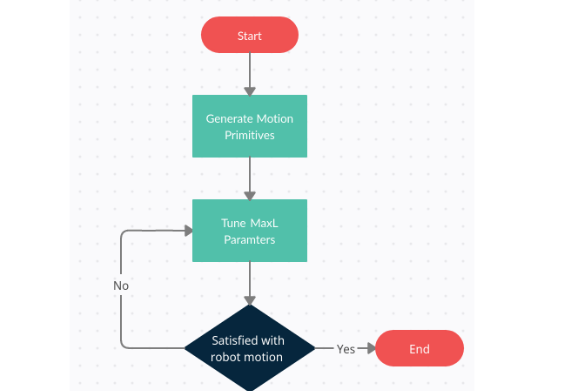
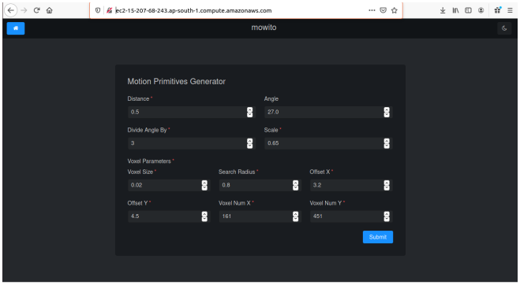
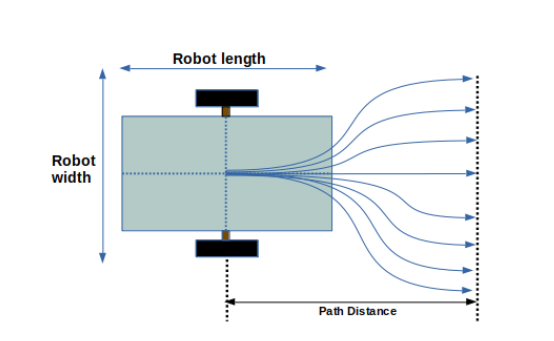
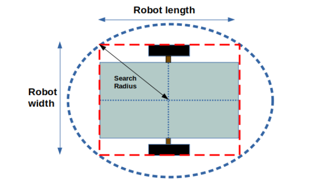
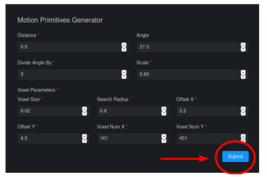
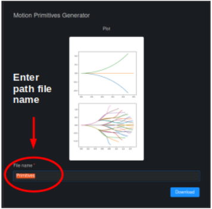

==============================================
MaxL Controller Tuning Guide
==============================================

This is a guide that will describe the steps to tune the MaxL controller for any deployment of the Mowito Navigation Stack. This guide shall provide all the parameters that are required to be tuned, their significance and description of what the parameters mean. 

This guide is typically meant for the end users who will be using the Mowito Navigation stack and have deployed the navigation stack on their respective hardware. This guide will only address the controller and obstacle avoidance functionality of the Mowito Navigation Stack.

-----------------------------------------
Steps to tuning the MaxL Controller
-----------------------------------------

The MaxL controller is a proprietary state of the art control and obstacle avoidance system that has the ability to process information and control the robot and avoid obstacles with a refresh rate as high as 50 Hz. In order to use the MaxL controller provided in the Mowito Navigation Stack, the controller is required to be tuned.

The following flow chart shall highlight the steps to follow for tuning the MaxL controller.

The process of tuning the controller involves two major steps :

Step 1 : Generating the motion primitives
^^^^^^^^^^^^^^^^^^^^^^^^^^^^^^^^^^^^^^^^^^^^^^

Generating the Motion primitives involves generating a set of paths the robot can take during the robot motion. These set of paths are critical and depend on the robot dimensions. This is generally a one time step. 

However, any change in the robot dimensions will require motion primitives to be regenerated.

Step 2 : Tuning the MaxL Parameters
^^^^^^^^^^^^^^^^^^^^^^^^^^^^^^^^^^^^^^^

Tuning the MaxL Parameters involves setting the MaxL parameters in the mw_maxl_planner.yaml file which is generally located in the controller_config folder in your repository. The values in this file can be modified based on the desired robot motion and can be set as many times until the desired robot motion is achieved. 

Section 3 shall describe the method to generate the motion primitives and Section 4 shall describe the methods to tune the MaxL parameters located in the mw_maxl_planner.yml file. 

----------------------------------------------------------
Step 1 : Generating Motion Primitives for the Controller
----------------------------------------------------------

As stated in section 2, the Motion Primitives are a set of precomputed paths that the robot can take while the robot is in motion. Whenever an obstacle confronts the robot, some of the precomputed paths are blocked and the controller chooses a path from the set of paths that are not blocked. 

While tuning the controller generation of these precomputed paths is a mandatory first step. To generate the motion primitives, the following information is required :

1. Robot Length
2. Robot Width 

The motion primitives would be generated using a tool provided by Mowito. 

Here are the steps to generate the motion primitives:

Accessing the motion primitives generator web tool
^^^^^^^^^^^^^^^^^^^^^^^^^^^^^^^^^^^^^^^^^^^^^^^^^^^^^

The motion primitives are generated using a web tool developed by Mowito. So inoder to generate the motion primitives, the user must access the web tool.

`Here is the link to the web tool <http://ec2-15-207-68-243.ap-south-1.compute.amazonaws.com/>`_

Upon accessing the web tool, the user will land onto the following page : 

Setting the motion primitive parameters to generate the motion primitives
^^^^^^^^^^^^^^^^^^^^^^^^^^^^^^^^^^^^^^^^^^^^^^^^^^^^^^^^^^^^^^^^^^^^^^^^^^^^^^^^
Inorder to generate the motion primitives, certain parameters are required to be set. The parameters that are required to be set by the user are :

1. Path Distance or simply Distance
2. Search Radius

The aforementioned parameters are the **ONLY TWO PARAMETERS** that the **USER MUST SET**.
Tampering any other parameter shall generate wrong motion primitives. 

The details of the two parameters are as follows :

1. Path Distance
~~~~~~~~~~~~

The distance basically indicates the length  of the motion primitives from the center of the robot. The following diagram gives an illustration of the path distance.

The path distance value shall remain within the following bounds : 
Minimum path distance : (Robot Length)/2 
Maximum path distance : obstacle horizon distance (shall be explained in section 4) 

2. Search radius 
~~~~~~~~~~~~~~~~~~

The search radius for the motion primitives shall be set a value equal to the radius of the circle that encircles the robot. The search radius parameter is illustrated in the following diagram. 

Basically a higher search radius will provide a greater safety shield around the robot while the algorithm selects a path. However, a higher search radius will also lead to lesser free paths being available when the robot is confronted by an obstacle. 

Thus it would be wise and apt to set the search radius to a value = radius of the circle encircling the robot.

Hit the Submit button 
^^^^^^^^^^^^^^^^^^^^^^^^

The motion primitives will begin generation and a progress bar is displayed to track it
^^^^^^^^^^^^^^^^^^^^^^^^^^^^^^^^^^^^^^^^^^^^^^^^^^^^^^^^^^^^^^^^^^^^^^^^^^^^^^^^^^^^^^^^^^^^^^^^^^^^^

.. image:: Images/maxl/progress.png
   :align: center

After completion
^^^^^^^^^^^^^^^^^
the web tool will display the motion primitives and will display the paths generated. Further the tool will prompt the user to enter the name for the paths that are generated

A general convention to name the motion primitive file is given below

**mw_mprim_dxdd_rxrr**

d = path distance 
r = search radius

For example, the naming of the path file for motion primitives with path distance = 1.2 m and search radius = 0.55 m would be as follows :

mw_mprim_1x20_0x55

Another example, the naming of the path file for motion primitives with path distance = 0.75 m and search radius = 0.65 m would be as follows :

mw_mprim_0x75_0x65

Hit the download button
^^^^^^^^^^^^^^^^^^^^^^^^^^^^
Uncompress the downloaded folder and place it in the active working directory in your robot workspace.

--------------------------------------------
Step 2 : Configuring the MaxL parameters
--------------------------------------------

The MaxL parameters are the parameters that help the algorithm decide what path to select during the robot motion when confronted by an obstacle and otherwise. This section shall describe all the parameters that the user must configure and will provide a description of these parameters and significance of these parameters.

The parameters are present in the mw_maxl_planner.yml file which is located in the controller_config folder.

The following image shows the mw_maxl_planner.yml file and the parameters available. 

The following are the **ONLY** parameters that the user **MUST MODIFY OR TUNE**. Please **DO NOT MODIFY ANY OTHER PARAMETERS IN THE FILE**.

1 pathFolder
2 maxSpeed
3 maxAccel
4 min_lookahead
5 max_lookahead
6 vehicleLength
7 vehicleWidth
8 max_yaw_rate
9 in_place_rotation_penalty
10 goal_direction_preference
11 x_inflate
12 y_inflate
13 obstacle_horizon

  
The description and significance of these parameters is given below :

pathFolder:
^^^^^^^^^^^^^

This parameter specifies the path for the motion primitives folder where path files are located.

maxSpeed:
^^^^^^^^^^^^^

This parameter specifies the maximum speed the robot can operate at. 

Units                : m/s 
Nominal Value : 2 m/s

Typically a higher speed would help achieve the robot reach the target point faster. On the flipside, a higher speed can induce a higher load on the motor in stopping the robot. Set this value asper the stopping capabilities of the motor in use and loads the motor can handle.
 
maxAccel:
^^^^^^^^^^^^^
This parameter specifies the maximum acceleration the robot can operate at.

Units                : m/s2
Nominal Value : 0.5 m/s2

Typically a high acceleration value can lead to a jerky motion and can stress the motor operating the robot. Hence it is advised to have the acceleration values set on the lower side. Preferably the acceleration values can range anywhere between 0.5 m/s2 and 1.5 m/s2. 

min_lookahead:
^^^^^^^^^^^^^^^^^^^^^^^^^^
This parameter specifies the minimum lookahead point the robot must reach on the global path when the robot is in motion .

Units : m
Nominal value : (Robot length / 2) * 1.1

Typically this parameter provides the smallest lookahead target the robot must achieve on the global path during the robot motion. The actual lookahead point shall be a value that would be within the bounds of the min_lookahead and the max_lookahead.

max_lookahead:
^^^^^^^^^^^^^^^^^^^^^^^^^^

This parameter specifies the maximum lookahead point the robot must reach on the global path when the robot is in motion .

Units : m
Nominal value : -

Typically this parameter provides the farthest lookahead target the robot must achieve on the global path during the robot motion. The actual lookahead point shall be a value that would be within the bounds of the min_lookahead and the max_lookahead.

It is generally advisable to have the min_lookahead fixed and vary the max_lookahead to achieve the desired motion.

Generally the user is advised to set a larger max_lookahead value in floorspaces where the floor space is large and has dimensions greater than the max range of the LiDAR being used.
Thus, having a robot with a higher max_lookahead in larger floor spaces will generate a smoother motion than a robot with smaller max_lookahead value.

However, in smaller floor spaces where the dimensions of the floor space are less than the max range of the LiDAR being used, it is advisable to have a smaller max_lookahead value and the max_lookahead in such cases can be set to the path distance parameter value specified while generating the motion primitives.

More specifically, it is advised to have a smaller max_lookahead value for robots attempting to travel through constrained door passages.

vehicleLength:
^^^^^^^^^^^^^^^^^^^^^^^^^^

This parameter specifies the robot length. 

Unit : m 

vehicleWidth:
^^^^^^^^^^^^^^^^^^^^^^^^^^

This parameter specifies the robot width. 

Unit : m

The robot length and width must be calculated taking into account all the auxiliary devices connected to the robot that are protruding outside the robot chassis.

The following diagram illustrates the calculation of the robot length and width.

max_yaw_rate:
^^^^^^^^^^^^^^^^^^^^^^^^^^

This parameter specifies speed at which the robot performs on spot turn. 

Units : rad/s

Nominal value : 0.5

Generally, it is advisable to have a low max_yaw_rate as the robot, during the path selection when confronted by an obstacle will react slower to the MaxL algorithm when the algorithm is oscillating between potential paths. This can significantly reduce the odometry and localization errors that are caused by aggressive robot oscillations.

in_place_rotation_penalty
^^^^^^^^^^^^^^^^^^^^^^^^^^
This parameter specifies the weight factor to be used while scoring the different free paths available when the robot is confronted by an obstacle.

Setting a high value for this parameter reduces the in place rotations of the robot and prevents the robot from oscillating when confronted by obstacles.

Nominal Value : 2.15

goal_direction_preference
^^^^^^^^^^^^^^^^^^^^^^^^^^

This parameter specifies the weight factor to be used while scoring the different free paths available when the robot is confronted by an obstacle.

Setting a high value to this parameter shall set the robot to choose a path closer to the tager goal point. 

Nominal value : 0.8

It is generally advisable to have a lower goal_direction_preference value in cluttered environments. This allows the robot to choose paths farther from the goal and still be successful in reaching the target goal point. A higher goal_direction_preference in a cluttered environment will prevent the robot from taking a father path and would lead to the robot not being able to reach the target goalpoint.

x_inflate
^^^^^^^^^^^^^^^^^^^^^^^^^^
This parameter specifies the inflation around the obstacle in the longitudinal direction.

Basically this parameter specifies the region of influence the obstacle has for the robot to compute its local path.

Units                :   m
Nominal value  :  0.1 m

y_inflate
^^^^^^^^^^^^^^^^^^^^^^^^^^
This parameter specifies the inflation around the obstacle in the lateral direction.

Basically this parameter specifies the region of influence the obstacle has for the robot to compute its local path.

Units                :   m
Nominal value  :  0.1 m

obstacle_horizon
^^^^^^^^^^^^^^^^^^^^^^^^^^
This parameter specifies the distance to which the robot must look inorder to detect an obstacle.

Units                : m
Nominal value : 1.5 m

It is advisable to have this parameter to be set to a higher value inorder to have a smother robot motion.

Further, it is **MANDATORY** to have the obstacle_horizon value **to be greater** than the **path distance of the motion primitives**.
