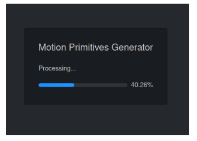

==============================================
MaxL Controller Tuning Guide
==============================================
This is a guide that will describe the steps to tune the MaxL controller for any deployment of the Mowito Navigation Stack. This guide shall provide all the parameters that are required to be tuned, their significance and description of what the parameters mean. 

This guide is typically meant for the end users who will be using the Mowito Navigation stack and have deployed the navigation stack on their respective hardware. This guide will only address the controller and obstacle avoidance functionality of the Mowito Navigation Stack.

-----------------------------------------
Steps to tuning the MaxL Controller
-----------------------------------------

The MaxL controller is a proprietary state of the art control and obstacle avoidance system that has the ability to process information and control the robot and avoid obstacles with a refresh rate as high as 50 Hz. In order to use the MaxL controller provided in the Mowito Navigation Stack, the controller is required to be tuned.

The following flow chart shall highlight the steps to follow for tuning the MaxL controller.

.. image:: Images/maxl/stages.png
   :align: center

The process of tuning the controller involves two major steps :

----------------------------------------------------------
Step 1 : Generating Motion Primitives for the Controller
----------------------------------------------------------

The Motion Primitives are a set of precomputed paths that the robot can take while the robot is in motion. Whenever an obstacle confronts the robot, some of the precomputed paths are blocked and the controller chooses a path from the set of paths that are not blocked. 

While tuning the controller generation of these precomputed paths is a mandatory first step. To generate the motion primitives, the following information is required :

1. Robot Length
2. Robot Width 

The motion primitives would be generated using a tool provided by Mowito. 

Here are the steps to generate the motion primitives:

Accessing the motion primitives generator web tool
^^^^^^^^^^^^^^^^^^^^^^^^^^^^^^^^^^^^^^^^^^^^^^^^^^^^^

The motion primitives are generated using a web tool developed by Mowito. So inoder to generate the motion primitives, the user must access the web tool.

`Here is the link to the web tool <http://ec2-15-207-68-243.ap-south-1.compute.amazonaws.com/>`_

Upon accessing the web tool, the user will land onto the following page : 

.. image:: Images/maxl/mprim_generator.png
   :align: center

Setting the motion primitive parameters to generate the motion primitives
^^^^^^^^^^^^^^^^^^^^^^^^^^^^^^^^^^^^^^^^^^^^^^^^^^^^^^^^^^^^^^^^^^^^^^^^^^^^^^^^
Inorder to generate the motion primitives, certain parameters are required to be set. The parameters that are required to be set by the user are :

1. Path Distance or simply Distance
2. Search Radius

The aforementioned parameters are the **ONLY TWO PARAMETERS** that the **USER MUST SET**.
Tampering any other parameter shall generate wrong motion primitives. 

The details of the two parameters are as follows :

1. Path Distance
~~~~~~~~~~~~

The distance basically indicates the length  of the motion primitives from the center of the robot. The following diagram gives an illustration of the path distance.

The path distance value shall remain within the following bounds : 
Minimum path distance : (Robot Length)/2 
Maximum path distance : obstacle horizon distance (shall be explained in section 4) 

2. Search radius 
~~~~~~~~~~~~~~~~~~

The search radius for the motion primitives shall be set a value equal to the radius of the circle that encircles the robot. The search radius parameter is illustrated in the following diagram. 

.. image:: Images/maxl/search_radius.png
   :align: center

Basically a higher search radius will provide a greater safety shield around the robot while the algorithm selects a path. However, a higher search radius will also lead to lesser free paths being available when the robot is confronted by an obstacle. 

Thus it would be wise and apt to set the search radius to a value = radius of the circle encircling the robot.

Hit the Submit button 
^^^^^^^^^^^^^^^^^^^^^^^^

The motion primitives will begin generation and a progress bar is displayed to track it
^^^^^^^^^^^^^^^^^^^^^^^^^^^^^^^^^^^^^^^^^^^^^^^^^^^^^^^^^^^^^^^^^^^^^^^^^^^^^^^^^^^^^^^^^^^^^^^^^^^^^

After completion
^^^^^^^^^^^^^^^^^
the web tool will display the motion primitives and will display the paths generated. Further the tool will prompt the user to enter the name for the paths that are generated

.. image:: Images/maxl/filename.png
   :align: center

A general convention to name the motion primitive file is given below

**mw_mprim_dxdd_rxrr**

d = path distance 
r = search radius

For example, the naming of the path file for motion primitives with path distance = 1.2 m and search radius = 0.55 m would be as follows :

mw_mprim_1x20_0x55

Another example, the naming of the path file for motion primitives with path distance = 0.75 m and search radius = 0.65 m would be as follows :

mw_mprim_0x75_0x65

Hit the download button
^^^^^^^^^^^^^^^^^^^^^^^^^^^^
Uncompress the downloaded folder and place it in the active working directory in your robot workspace.

--------------------------------------------
Step 2 : Configuring the MaxL parameters
--------------------------------------------

The MaxL parameters are the parameters that help the algorithm decide what path to select during the robot motion when confronted by an obstacle and otherwise. There are four categories of MaxL parameters that the users can configure based on various condition. 

The parameters can be editted using the mw_maxl_planner.yml file which is located in the controller_config folder.

Parameters influneced by Bot architecture:
^^^^^^^^^^^^^^^^^^^^^^^^^^^^^^^^^^^^^^^^^^^^
* **vehicleLength** : Specifies the robot length. Unit : m
* **vehicleWidth** : Specifies the robot width. Unit : m
* **maxSpeed** : Specifies the maximum speed the robot can operate at. Unit : m/s
* **maxAccel** : Specifies the maximum acceleration the robot can operate at. Unit : m/s\ :sup:`2`
* **min_lookahead** : Specifies the minimum lookahead point the robot must reach on the global path when the robot is in motion. Unit : m. Nominal value : (Robot length / 2) * 1.1 
* **in_place_rotation_penalty** : This parameter specifies the weight factor to be used while scoring the different free paths available when the robot is confronted by an obstacle. The influence of this parameter on a ROSbot doing a 360\ :sup:`0` U-turn can be observed below.

.. image:: Images/maxl/in_place_rotation_penalty.gif
   :align: center
   :width: 600

Parameters influneced by environment and trajectories:
^^^^^^^^^^^^^^^^^^^^^^^^^^^^^^^^^^^^^^^^^^^^^^^^^^^^^^^^
* **pathFolder** : Specifies the path for the motion primitives folder where path files are located.
* **max_lookahead** : specifies the maximum lookahead point the robot must reach on the global path when the robot is in motion . Unit : m
* **max_yaw_rate** : Specifies speed at which the robot performs on spot turn. Unit : rad/s
* **yaw_gain** : Related to rotation of robot while in motion. Following plot shows performance of a ROSbot (time took to complete) on a given trajectory with different turn radii. 

* **goal_direction_preference** : Weight factor to be used while scoring the different free paths available when the robot is confronted by an obstacle. In cluttered environment it is recommended to have lower values. Nominal value : 0.8
* **obstacle_horizon** : specifies the distance to which the robot must look inorder to detect an obstacle. Units : m Nominal value : 1.5 m. There is a constraint on this parameter as follows.It should be greater than path distance of the motion primitives.

Users **should only** change the above mentioned parameters and **should not** change any other parameter values in the mw_maxl_planner.yml file